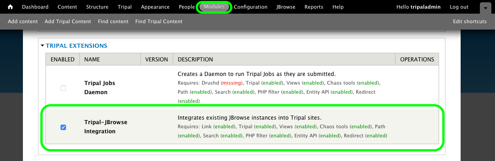

Tripal JBrowse Installation
============================

This module is available for download from github.com/tripal/tripal_jbrowse.

1. Download and upack the module into ``[DRUPAL ROOT]/sites/all/modules`` where ``DRUPAL_ROOT`` is the path to your Drupal site.
2. Navigate to ``https://yourdrupalsite.com/admin/modules`` or click **Administration Toolbar > Modules**
3. Scroll to **Tripal Extensions**, click the checkbox beside "Tripal JBrowse Integration", and click the "Save Configuration" button at the bottom of the page.

.. note::

   This module is dependent upon the **Link** module. It is not mentioned above in the install instructions since you should already have installed it when installing Tripal.
