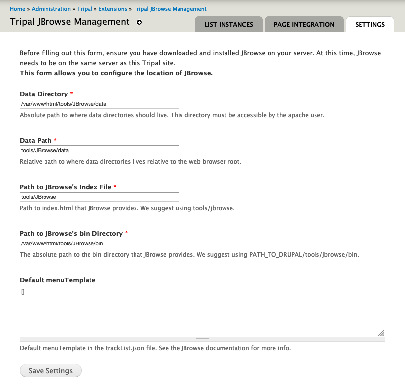

Installation and Configuration
==============================

Dependencies
------------

Please ensure that the following are installed on your server:

- `JBrowse <http://gmod.org/wiki/JBrowse_Configuration_Guide>`_.
- `Tripal <http://tripal.info>`_

Installation
------------

- Download the module to your Drupal modules folder
- Run ``drush en -y hardwoods_jbrowse`` or enable through the modules page
- Visit the configuration page at ``/admin/hardwoods_jbrowse/configure``

Configuring Tripal JBrowse
--------------------------

In order for the module to function properly, you need to first configure it.
Please visit ``http://YOUR_SITE/admin/hardwoods_jbrowse/configure`` (replace YOUR_SITE with your domain)
and fill out the form. You will need to know information about your JBrowse information.

