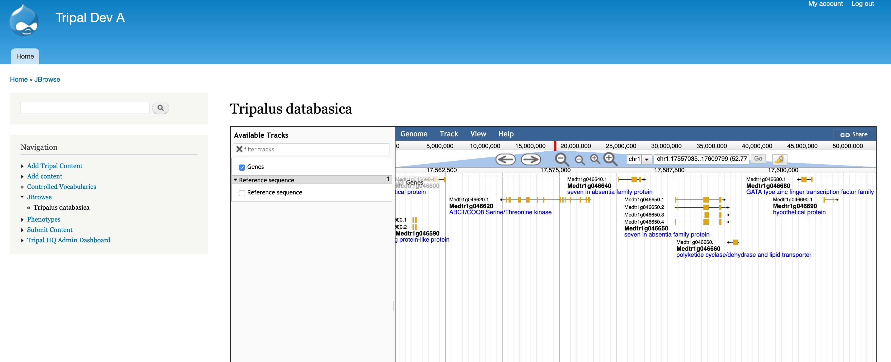
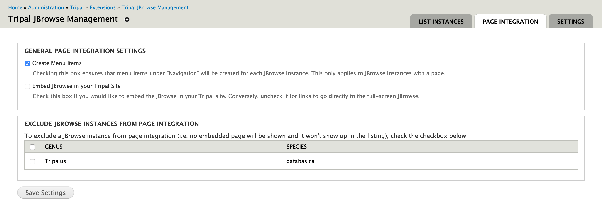
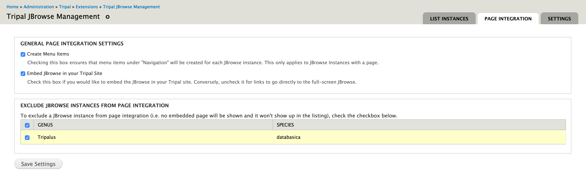

Tripal Page Integration
========================

Embedded JBrowse Instance
---------------------------

This guide will show you **how to embed a JBrowse instance within your Tripal site for an existing JBrowse instance**. This ensures a *consistent user experience* by making the menu system of the Tripal site available to the user while browsing. If the user needs more space they can choose the *FullScreen option* to remove the menus.

.. warning::

   This requires you already have a JBrowse instance created through the Tripal JBrowse Management sub-module. For information on how to do this, see the associated Tripal JBrowse Management documentation.

This is the default functionality of the "Tripal-JBrowse Page Integration" module. If you have already created your JBrowse instances using the "Tripal Jbrowse Management" module then enabling this module automatically creates pages and menu items for those instances!

Links to Original JBrowse
---------------------------

This guide will show you how to ensure the links created by this module direct users to the original JBrowse rather than to an embedded JBrowse page. This may be preferable if your theme does not provide much space to content thus causing the embedded JBrowse to be too small.

By installing the "Tripal-JBrowse Page Integration" module you will already have embedded JBrowse pages for all Tripal JBrowse instances created by the "Tripal JBrowse Management" module. To switch these links and pages to redirect to the original full-screen JBrowse, go to Administration Toolbar > Tripal > Extensions > Tripal JBrowse Management > Page Integration. **Here you simply need to uncheck the "Embed JBrowse in your site" checkbox and click "Save Settings"**

Now, all links in the ``yourdrupalsite.com/jbrowse`` listing and menu items will point the original, full screen JBrowse!

Exclude Specific JBrowse Instances
-----------------------------------

Sometimes you may want to manage a JBrowse Instance using "Tripal JBrowse Management" but not display it to users through "Tripal-JBrowse Page Integration". For example, if you have just begun development and are not ready to release it. To do this, go to Administration Toolbar > Tripal > Extensions > Tripal JBrowse Management > Page Integration. Check the checkbox beside the instance you would like to exclude from menu items, lists and pages and click "Save Settings".

