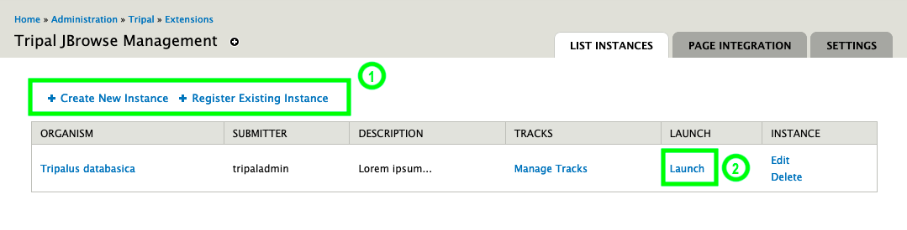

Managing Instances
==================

Listing and Creating Instances
------------------------------

To list all instances, visit ``/admin/hardwoods_jbrowse``.

Creating Instances
------------------

As highlighted on the screenshot above, you can create new instances by clicking the "Add New Instance" link.

Deleting Instances
------------------

To delete an instance, you must first visit the instances list page and clicking the delete instance link.
Note that the actual files for the instance are not deleted. You will need to delete all files manually.
