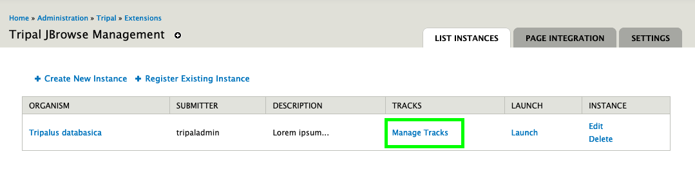
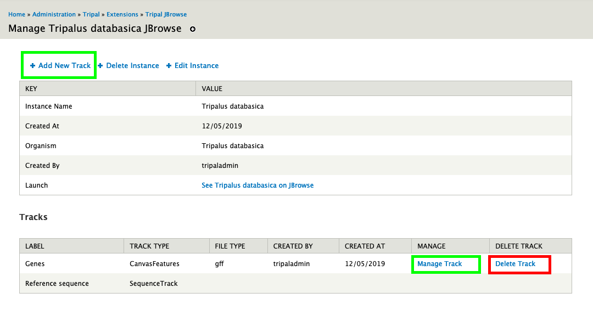

Managing Tracks
===============

Creating and Deleting Tracks
----------------------------

To create a new track, you need visit the instances list page and click Manage Tracks.

The manage tracks link, will lead to a page where you can create and delete tracks (see screenshot below).

.. warning::
    Please note that files don't get automatically removed. You have to manually remove the track files yourself.

Editing Tracks
--------------

This modules allows you to configure a track after it has been created. This provides a way to
add the track to a category, change the colors and type of the track amongst other configuration options.

To edit a track, simply click the manage track button on the "manage tracks" page as shown on the screenshot above.
