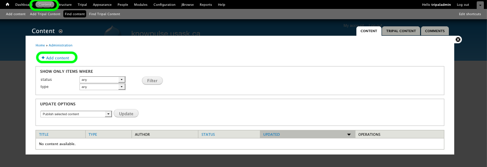
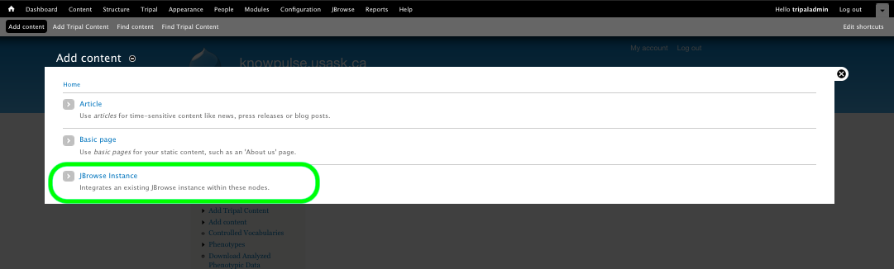
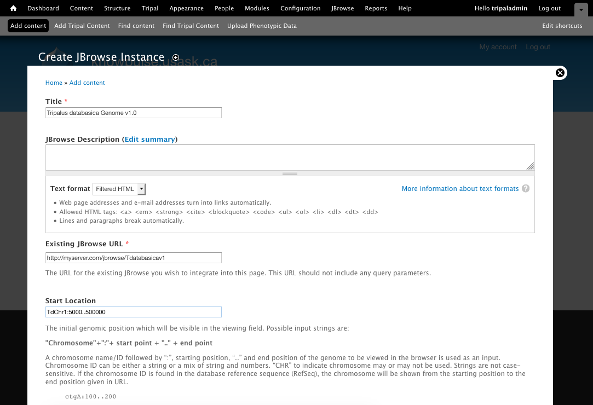

JBrowse Instance Page
======================

This guide will show you **how to create a page within your Tripal site for an existing JBrowse instance**. This ensures a *consistent user experience* by making the menu system of the Tripal site available to the user while browsing. If the user needs more space they can choose the *FullScreen option* to remove the menus.

.. warning::

   This requires you already have a JBrowse instance. Both local (hosted on the same machine as your Tripal site) or external JBrowse instances are supported.

.. note::

   The Tripal JBrowse Management sub-module provides a user interface to ease setup of multiple JBrowse instances. It is a great option but is not required.

You create a JBrowse Instance page by navigating to **Content > Add Content > JBrowse Instance** on the Administration Toolbar. Then just fill out the form and click save!

The **title** will become the title of the page and the **description** will be shown above the JBrowse instances. The description is a good place to add any warnings or instructions.

The **Existing JBrowse URL** is the URL to the JBrowse instance you want to embed. You should be able to put this URL into your browser and access the JBrowse instance directly, even in the case of local instances.

The **Start Locations** allows you to specify where you want the JBrowse to navigate to for first time users. Keep in mind that JBrowse caches user location and thus all subsequent times a user accesses the instance it will start at their last browsed location.

.. image:: instancepage.4.createbottom.png

The **Tracks** allows you to set which tracks you want shown by default. You should enter the machine name of the tracks here with multiple tracks separated by comma's.

.. note::

    Depending on how your Drupal site is configured, you may be presented with a **Preview** button instead of a **Save** button. In this case, simply click Preview and then on the next page, click Save.

    The preview for the JBrowse may not load properly. Do not be concerned as this is not an indication that you have incorrectly configured the page.

    To disable the preview button, navigate to Structure > Content Types > JBrowse Instance > edit and set the "Submission for settings" > "Preview before submitting" to "Disabled".
